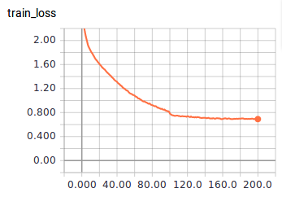
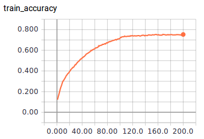
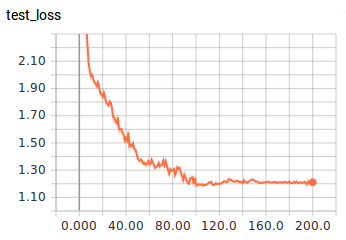
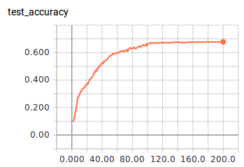

# 鄭敬儒<span style="color:red">_103061240</span>

# Project 5 / Deep Classification

## Overview
> The goal of this project is classification based on deep learning. In this project, we use the CIFAR-10 dataset as training data and testing data. I choose DenseNet as my model. Then I train the DenseNet and valid it at the same time. Finally, we can test the model and show it accuracy.

## Implementation
### Data
* I use function download the data cifar-10 on Internet, then using function prepare_data() to divide the dataset into training part and testing part including label.
* Then I normalize the training and testing data as data preprocessing. 
```
def color_preprocessing(x_train, x_test):
    x_train = x_train.astype('float32')
    x_test = x_test.astype('float32')
    x_train[:, :, :, 0] = (x_train[:, :, :, 0] - np.mean(x_train[:, :, :, 0])) / np.std(x_train[:, :, :, 0])
    x_train[:, :, :, 1] = (x_train[:, :, :, 1] - np.mean(x_train[:, :, :, 1])) / np.std(x_train[:, :, :, 1])
    x_train[:, :, :, 2] = (x_train[:, :, :, 2] - np.mean(x_train[:, :, :, 2])) / np.std(x_train[:, :, :, 2])

    x_test[:, :, :, 0] = (x_test[:, :, :, 0] - np.mean(x_test[:, :, :, 0])) / np.std(x_test[:, :, :, 0])
    x_test[:, :, :, 1] = (x_test[:, :, :, 1] - np.mean(x_test[:, :, :, 1])) / np.std(x_test[:, :, :, 1])
    x_test[:, :, :, 2] = (x_test[:, :, :, 2] - np.mean(x_test[:, :, :, 2])) / np.std(x_test[:, :, :, 2])

    return x_train, x_test
```
### Model
* I use the **DenseNet** as my model. Here is DenseNet structure.


### Training
* In Hyperparameter part, setting batch_size = 64, iteration = 200 and training 200 epoch. 
* Beside, learning_rate = 1e-4 and it will decrease half when epoch = 100 and 150.
* My loss function and optimizer are cross entropy and AdamOptimizer.
* I also do the dropout in the training part. dropout_rate = 0.2.
* I test(valid) the model and train at the same time, so in the result I will show the training loss, accuracy and testing(validation) loss and accuracy.
* For calculating the training loss and accuracy is that in each iteration I calculate mean of training loss and accuracy.

### Testing
* In testing part, I test the 100 image each time and calculate the mean of testing loss and accuracy.
```
def Evaluate(sess):
    test_acc = 0.0
    test_loss = 0.0
    test_pre_index = 0
    add = 1000

    for it in range(test_iteration):
        test_batch_x = test_x[test_pre_index: test_pre_index + add]
        test_batch_y = test_y[test_pre_index: test_pre_index + add]
        test_pre_index = test_pre_index + add

        test_feed_dict = {
            x: test_batch_x,
            label: test_batch_y,
            #learning_rate: epoch_learning_rate,
            training_flag: False
        }

        loss_, acc_ = sess.run([cost, accuracy], feed_dict=test_feed_dict)

        test_loss += loss_ / 10.0
        test_acc += acc_ / 10.0

    return test_acc, test_loss
```

## Installation
* Other required packages. No
* How to compile from source?  I compile in linux terminal on my laptop.

## Results
* Here I will show the training loss, accuracy and testing(validation) loss and accuracy in the training. (Using tensorboard)

<table border=1>
<tr>
<td>




</td>
</tr>

</table>

## Reference
* **DenseNet** : https://github.com/taki0112/Densenet-Tensorflow
