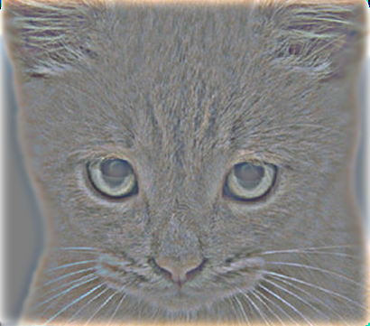
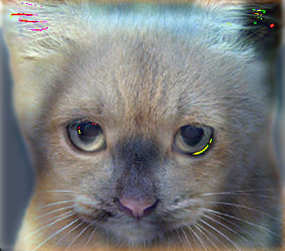
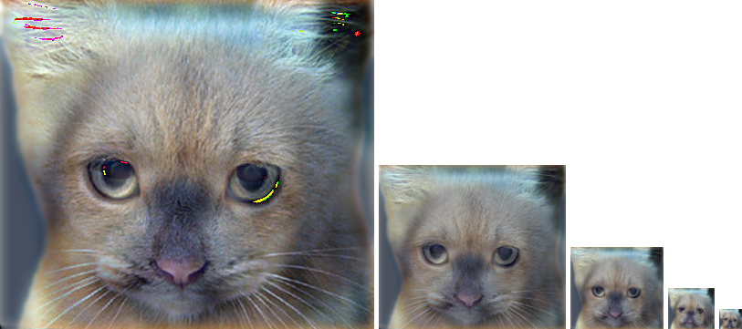
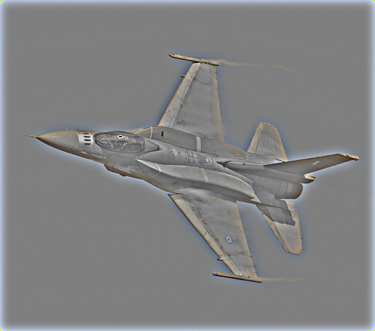
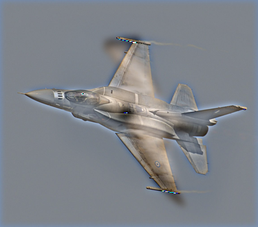
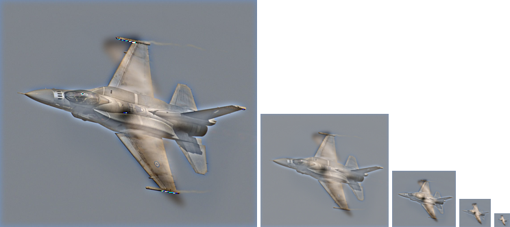
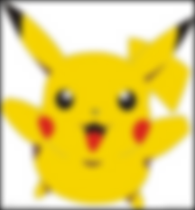
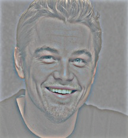
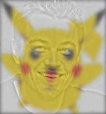
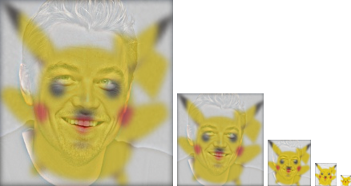

# 鄭敬儒<span style="color:red">_103061240</span>

# Project 1 / Image Filtering and Hybrid Images

## Overview
> 這個project的目標是實作Hybrid Images。首先實作一個2D convolution for color image，且圖片大小不會改變；
接著藉由2D convolution，將兩張照片分別經過low pass filter and high pass filter進行2D convolution運算；
最後將經過low pass filter和high pass filter的結果相加，便可以得到目標：Hybrid Images！


## Implementation
1. 實作2D convolution：my_filter.py
	* 讓 Input and Output 的 image size 一樣
	  此處我的作法為 zero padding。 下方的code中， x,y表示input image的長寬， m,n表示filter的長寬。
	  其中 x - m + 1 和 y - n + 1 代表padding前做convolution時，filter在兩個維度上的移動量。
	  也就是output image size的大小(會縮小)。 再用原圖大小x,y去扣output size就是要padding的量，
	  因為目標是原圖和output的size要相同。 而除以2是代表padding在上下和左右個別的量。
	  
	* 用np.pad和一個for loop將每個channel都padding完成
	
	* 利用3個for loop來實作2D convolution for color images，i,j兩個維度分別表示長寬，而k則表示RGB三個channel，
	  image和filter做點對點相乘，再sum起來
	
	  ```
	  #padding part
          pad_w = (x - (x - m + 1))/2
          pad_h = (y - (y - n + 1))/2
          pad_image = np.zeros((x+2*pad_w,y+2*pad_h,z))
          for pad_ch in range(z):
             pad_image[:,:,pad_ch] = np.pad(image[:,:,pad_ch], ((pad_h, pad_h), (pad_w, pad_w)), 
             'constant', constant_values = ((0,0),(0,0)))
	  
	  #convolution part
	  x_run = x - m + 1
	  y_run = y - n + 1
	  for i in range(x_run):
	      for j in range(y_run):
                for k in range(z):
                    output[i,j,k] = np.sum(pad_image[i:i+m, j:j+n, k]*imfilter)
          ```
	  

2. 實作Hybrid Images：proj1.py
	* 利用my_filter和2D Gaussian filter，製作出image1的low_frequencies圖片
	  接著用相同手法製作出image2的low_frequencies圖片，並用image2 - low_frequencies，便可得到high frequency部份。
	  最後再將low_frequencies和high frequency圖片相加，即可得到Hybrid Images。
	  
	  ```
          low_frequencies = my_imfilter(image1, gaussian_filter)
          high_frequencies = image2 - my_imfilter(image2, gaussian_filter)
          hybrid_image = low_frequencies + high_frequencies
	  ```
	 
## Installation
* Other required packages? 
    Install matplotlib, pillow by pip install
* How to compile from source?
    I compile in linux terminal

### Results
1. dog: low frequency ； cat: high frequency
<table border=1>
<tr>
<td>



</td>
</tr>

<tr>
<td>

</td>
</tr>

</table>

2. bird: low frequency ； plane: high frequency
<table border=1>
<tr>
<td>



</td>
</tr>

<tr>
<td>

</td>
</tr>

</table>

3. 皮卡丘: low frequency ； 李奧納多: high frequency(with normalization)
<table border=1>
<tr>
<td>



</td>
</tr>

<tr>
<td>

</td>
</tr>

</table>
