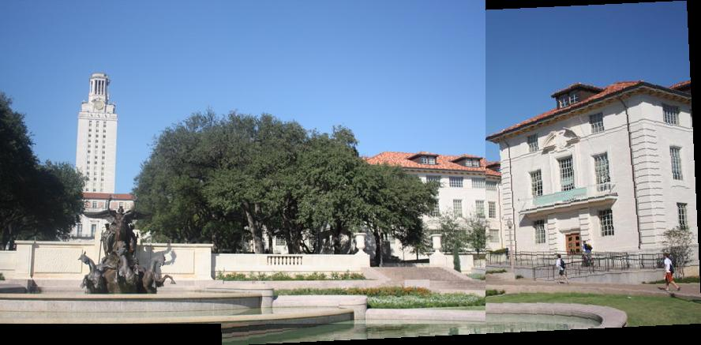
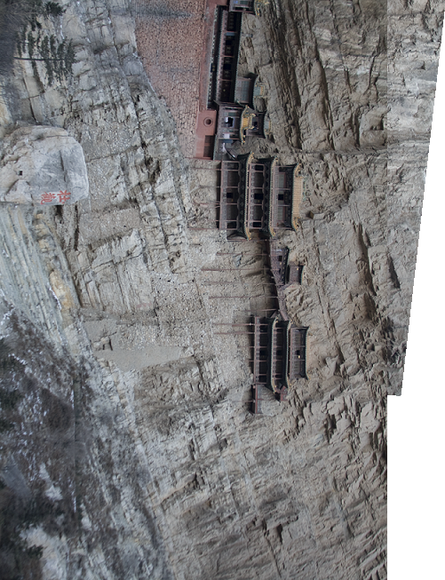
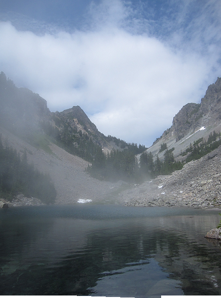
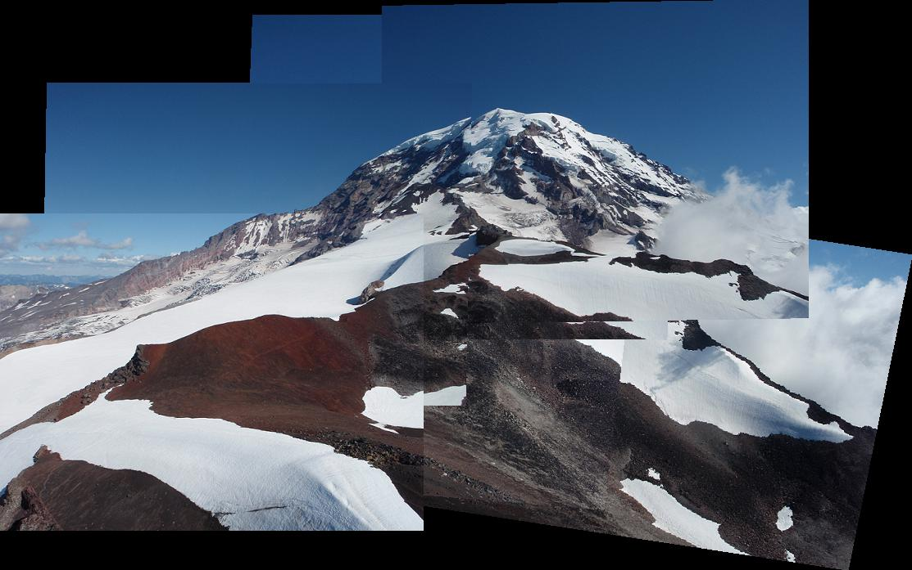

# 鄭敬儒<span style="color:red">_103061240</span>

# Project 2 / Panorama Stitching

## Overview
> The goal of this project is implementing Panorama Stitching. There are six steps to get the Panorama Stitching image and we need to carry out step of 2,3,4,5 to accomplish this project.
<br>(1). Detecting SIFT points and extracting SIFT descriptor for each keypoint in each image.
<br>(2). Comparing two parts of SIFT descriptor from two different images and finding their matching keypoints. 
<br>(3). Computing affine transformation matrix to transform positions in one image to the other.
<br>(4). Using RANSAC to get rid of outlier and giving a better estimate of affine transformation matrix.
<br>(5). Given that transformation matrix, use it to transform one image and overlay it on top of the other.
<br>(6). Stitching multiple images together.


## Implementation
1. Finding matching keypoints: SIFTSimpleMatcher.py (2)
	* Goal: Comparing two parts of SIFT descriptor from two different images and finding their matching keypoints.
	* Find the Euclidean distance between all the descriptor in descriptor1 and descriptor2. And each descriptor in descriptor1 will calculate lots of Euclidean distance with all descriptors in descriptor2. Then we find the Min and second Min Euclidean distance for each descriptor in descriptor1. 
	* If the Min is less than thresh*(second Min Euclidean distance), we store index of descriptor in descriptor1 and descriptors in descriptor2 which calculating Min Euclidean distance in the 'Match'
	
	  ```
	  check = 0
	  
	  #calculating Euclidean distance
	  for one in range(descriptor1.shape[0]):
        each_row = []
        each = np.tile(descriptor1[one],(descriptor2.shape[0],1))
        squ_each = np.square(each - descriptor2)
        for sq in range(squ_each.shape[0]):
            each_row.append(np.sqrt(sum(squ_each[sq])))   
	  
        #Finding the Min index
        smallest = min(each_row)
        smallest_ind = each_row.index(min(each_row))
        second = sorted(each_row)[1]
	  
        #Storing the Min index
        if smallest < (second*THRESH) :
            if check == 0:
                match = np.array([one, smallest_ind])
                check = check + 1
            else:
                match = np.vstack((match, [one, smallest_ind]))
	  ```
	
2. Computing affine transformation matrix: ComputeAffineMatrix.py (3)
	* Goal: Computing affine transformation matrix to transform positions in one image to the other.
	* P1, P2 are homogeneous coordintes. Then computing H (H * P1 = P2) by np.linalg.lstsq. But we need the format of Ax=b, so we transpose of both side of equation H * P1 = P2 to yield P1' * H' = P2'. Then Python can solve for H'. After that, I transpose the H' to get affine transformation matrix H

	  ```
	  trans, b, c, d = (np.linalg.lstsq(np.transpose(P1), np.transpose(P2)))
	  H = np.transpose(trans)
	  ```
	  
3. RANSAC: RANSACFit.py (4)
	* Goal: Getting rid of outlier and giving a better estimate of affine transformation matrix.
	* Computing error between transform the point in pt1 and its matching point in pt2

	  ```
	  #P1 in homogeneous coordinates
	  num1 = pt1.shape[0]
	  one = []
	  for i in range(num1):
	      one.append(1)
	  new_pt1 = np.vstack((np.transpose(pt1), one)) 
	  trans_pt1 = np.matmul(H,new_pt1)
	  fin_pt1 = np.transpose(trans_pt1)
	  
	  #P2 in homogeneous coordinates
	  num2 = pt2.shape[0]
	  two = []
	  for j in range(num2):
	      two.append(1)
	  new_pt2 = np.vstack((np.transpose(pt2), two))
	  fin_pt2 = np.transpose(new_pt2)
	  
	  #Error Euclidean distance between transformed pt1 and pt2
	  dists = []
	  for num in range(match.shape[0]):
	      dists.append(np.sqrt(sum(np.square(fin_pt1[match[num][0]] - fin_pt2[match[num][1]]))))
	  dists = np.transpose(dists)
	  ```
	  
4. Stitching multiple images: MultipleStitch.py (5)
	* Goal: Given that transformation matrix, use it to transform one image and overlay it on top of the other.
	* Transforming points in image1 to image2,3 or more. And transforming points in image5 to image4,3,2... 
	* There are two case to do it. First case is currentFrameIndex < refFrameIndex, it means if we want to transform image1 to image2,3 or more. So transformation matrix should be H1 * H2 * H3... depending on transforming to which image. Second case is currentFrameIndex > refFrameIndex it means if we want to transform image5 to image4,3,2... . So do the same thing in first case H4 * H3 * H2..., but finally we should calculate the inverse of it, so I use np.linalg.pinv to get the inverse of T.

	  ```
	  T = np.eye(3)
	  if (currentFrameIndex < refFrameIndex):
	       for x in range(currentFrameIndex, refFrameIndex):
	           T = np.matmul(i_To_iPlusOne_Transform[x], T)
	  else:
	       for y in range(refFrameIndex, currentFrameIndex):
	           T = np.matmul(i_To_iPlusOne_Transform[y], T)
	       T = np.linalg.pinv(T)
	  ```
## Installation
* Other required packages? Install Statistics by pip install and cyvlfeat by conda
* How to compile from source? I compile in linux terminal on my laptop.

### Results
1. Pair Stitch
<table border=1>
<tr>
<td>



</td>
</tr>

</table>

2. Multiple Stitch
<table border=1>
<tr>
<td>


</td>
</tr>

</table>
